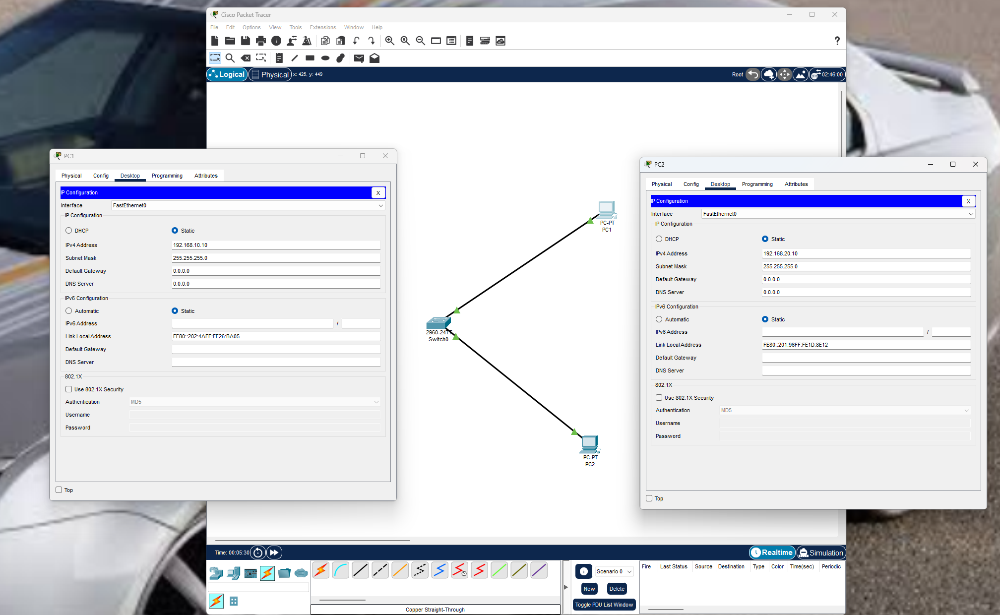
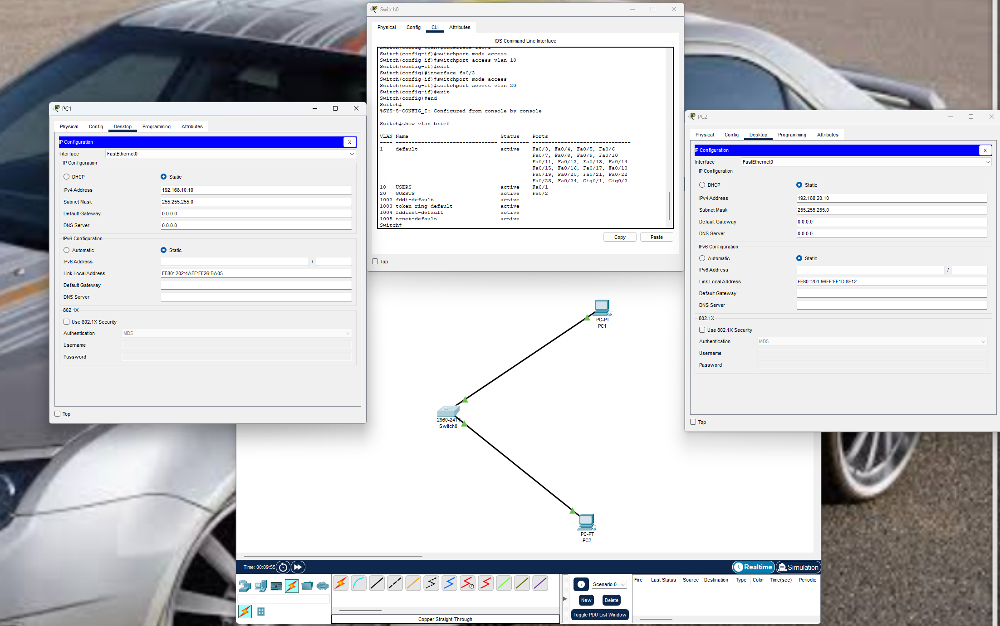
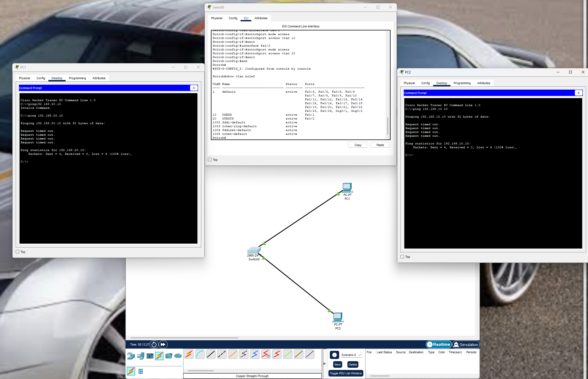

# LAB 002 - VLAN Segmentation

## Objective

Configure VLANs on a Cisco switch and demonstrate traffic isolation between different network segments.

## Topology

PC1 ---- VLAN 10 ---- Switch ---- VLAN 20 ---- PC2

## Topology Diagram



## IP Configuration

### PC1

* IP Address: 192.168.10.10
* Subnet Mask: 255.255.255.0

### PC2

* IP Address: 192.168.20.10
* Subnet Mask: 255.255.255.0

## VLAN Configuration

### VLAN 10

* Name: USERS
* Port: Fa0/1

### VLAN 20

* Name: GUESTS
* Port: Fa0/2

## Switch Configuration

```bash
enable
configure terminal

vlan 10
name USERS

vlan 20
name GUESTS

interface fa0/1
switchport mode access
switchport access vlan 10

interface fa0/2
switchport mode access
switchport access vlan 20

end
write memory
```

## VLAN Verification

The VLAN configuration was verified using the command:

```bash
show vlan brief
```

Expected result:

* VLAN 10 assigned to Fa0/1
* VLAN 20 assigned to Fa0/2



## Connectivity Test

A connectivity test was performed between hosts located in different VLANs.

PC1 attempted to communicate with PC2 using ICMP (ping).

Because no Layer 3 routing was configured, communication between VLANs was blocked.

Result:

* Request Timed Out
* 100% Packet Loss



## Security Concept

VLANs provide logical network segmentation, reducing unnecessary communication between devices and improving network security.

Benefits include:

* Traffic isolation
* Reduced attack surface
* Better network organization
* Improved security controls
* Support for Zero Trust principles

## Skills Practiced

* VLAN Configuration
* Network Segmentation
* Cisco IOS
* Layer 2 Switching
* Network Security Fundamentals
* Basic Troubleshooting
* ICMP Testing
* Cisco Packet Tracer

## Result

The VLAN configuration was successfully implemented and validated. Devices belonging to different VLANs were unable to communicate, demonstrating proper traffic isolation at Layer 2.
