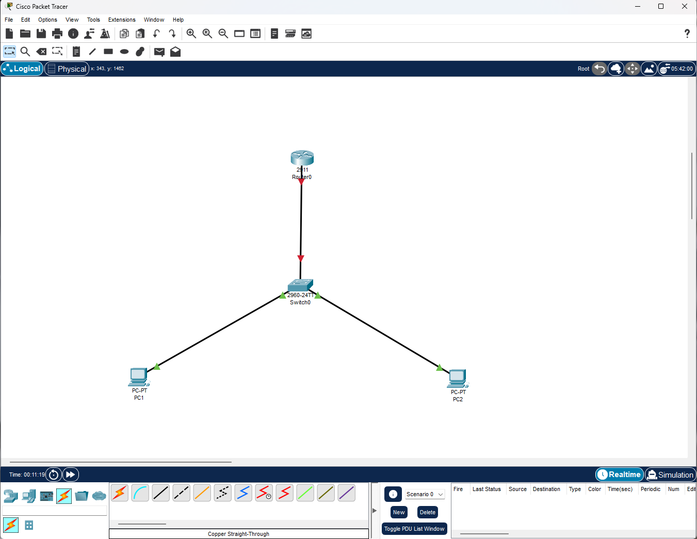
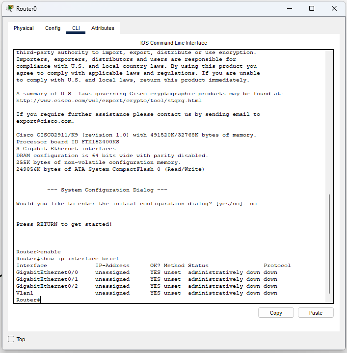
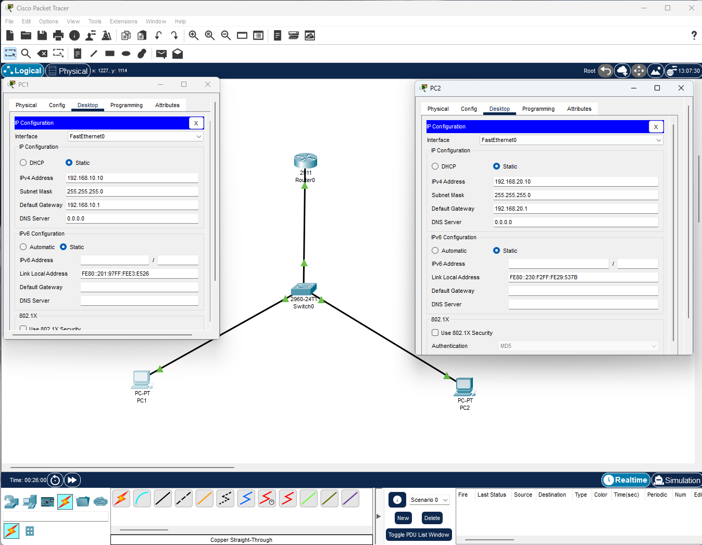
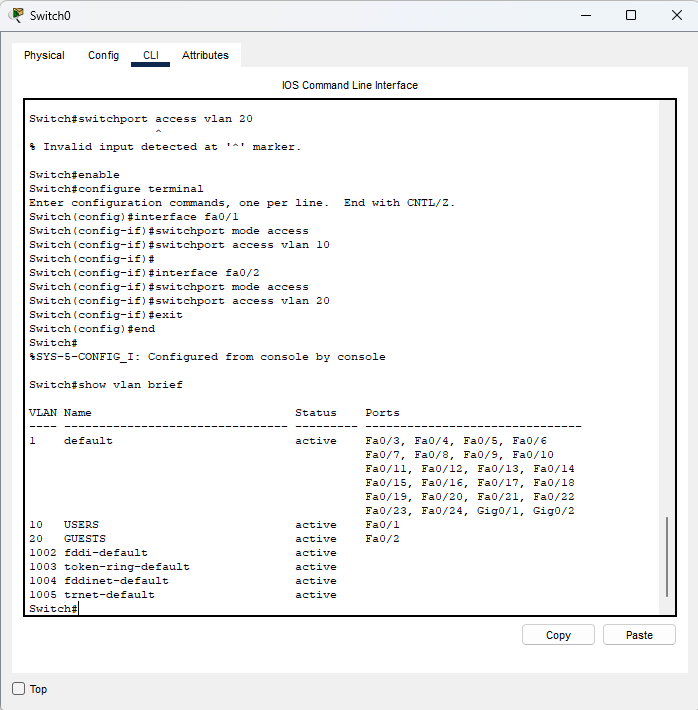
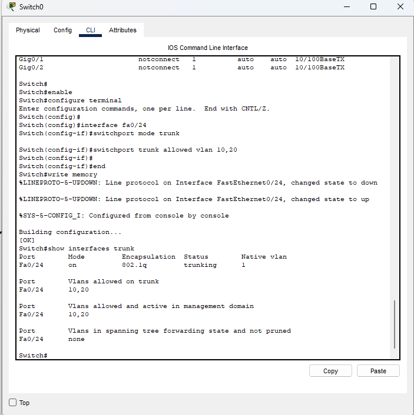
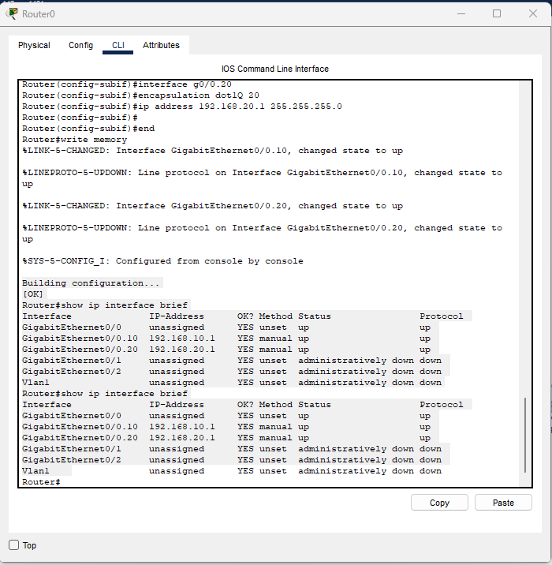
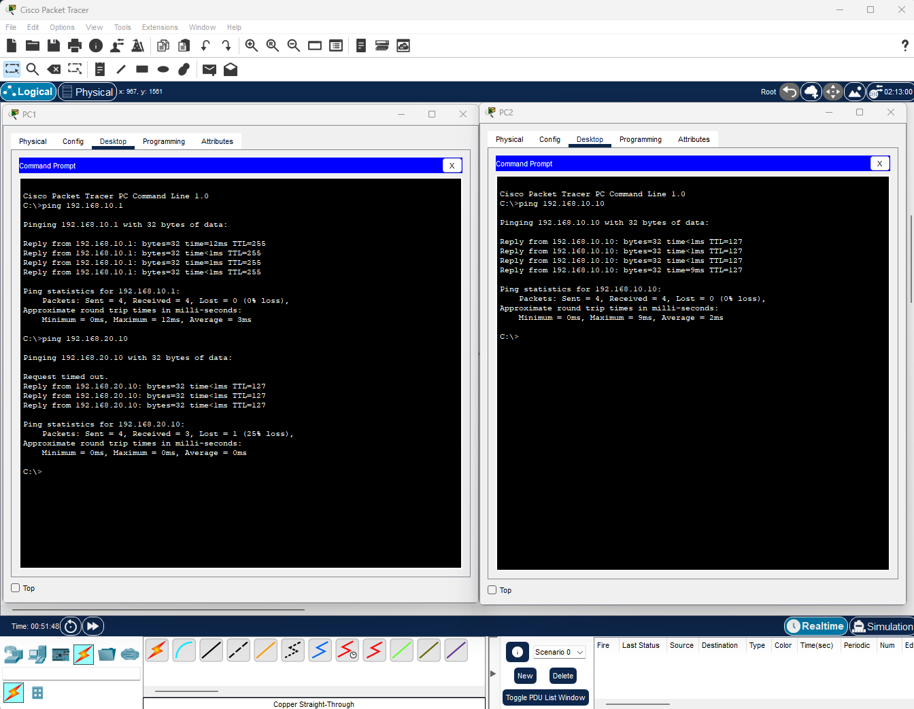

# LAB 003 - Inter-VLAN Routing

## Objective

Configure Inter-VLAN Routing using the Router-on-a-Stick method, allowing communication between hosts located in different VLANs.

---

## Topology

```text
PC1 ---- VLAN 10 ---- Switch ---- Trunk ---- Router 2911
PC2 ---- VLAN 20 ----/
```

### Network Diagram



---

## Initial Router State

The router interfaces were verified before configuration.

### Verification



---

## IP Addressing

### PC1

| Parameter | Value |
|------------|------------|
| IP Address | 192.168.10.10 |
| Subnet Mask | 255.255.255.0 |
| Default Gateway | 192.168.10.1 |

### PC2

| Parameter | Value |
|------------|------------|
| IP Address | 192.168.20.10 |
| Subnet Mask | 255.255.255.0 |
| Default Gateway | 192.168.20.1 |

### Configuration Screenshot



---

## VLAN Configuration

Two VLANs were created on the switch:

| VLAN | Name |
|--------|--------|
| 10 | USERS |
| 20 | GUESTS |

### Verification



---

## Trunk Configuration

The connection between the switch and the router was configured as an IEEE 802.1Q trunk.

### Verification



---

## Router-on-a-Stick Configuration

Subinterfaces were created on GigabitEthernet0/0:

| Interface | VLAN | IP Address |
|------------|--------|------------|
| G0/0.10 | 10 | 192.168.10.1 |
| G0/0.20 | 20 | 192.168.20.1 |

### Verification



---

## Connectivity Validation

Connectivity tests were performed between devices located in different VLANs.

### Results

- PC1 successfully reached 192.168.10.1 (VLAN 10 Gateway)
- PC1 successfully reached 192.168.20.10 (PC2)
- PC2 successfully reached 192.168.10.10 (PC1)
- Inter-VLAN Routing operated correctly

### Verification



---

## Security Concepts

This laboratory demonstrates:

- Network segmentation using VLANs
- Traffic isolation at Layer 2
- Controlled communication through Layer 3 routing
- Router-on-a-Stick architecture
- VLAN tagging with IEEE 802.1Q

---

## Skills Practiced

- VLAN Configuration
- Trunk Configuration
- Router-on-a-Stick
- Inter-VLAN Routing
- Cisco IOS
- Network Segmentation
- Layer 2 Switching
- Layer 3 Routing
- Troubleshooting
- Cisco Packet Tracer

---

## Result

Inter-VLAN Routing was successfully implemented and validated. Devices located in different VLANs were able to communicate through the Cisco 2911 router while maintaining logical network segmentation
