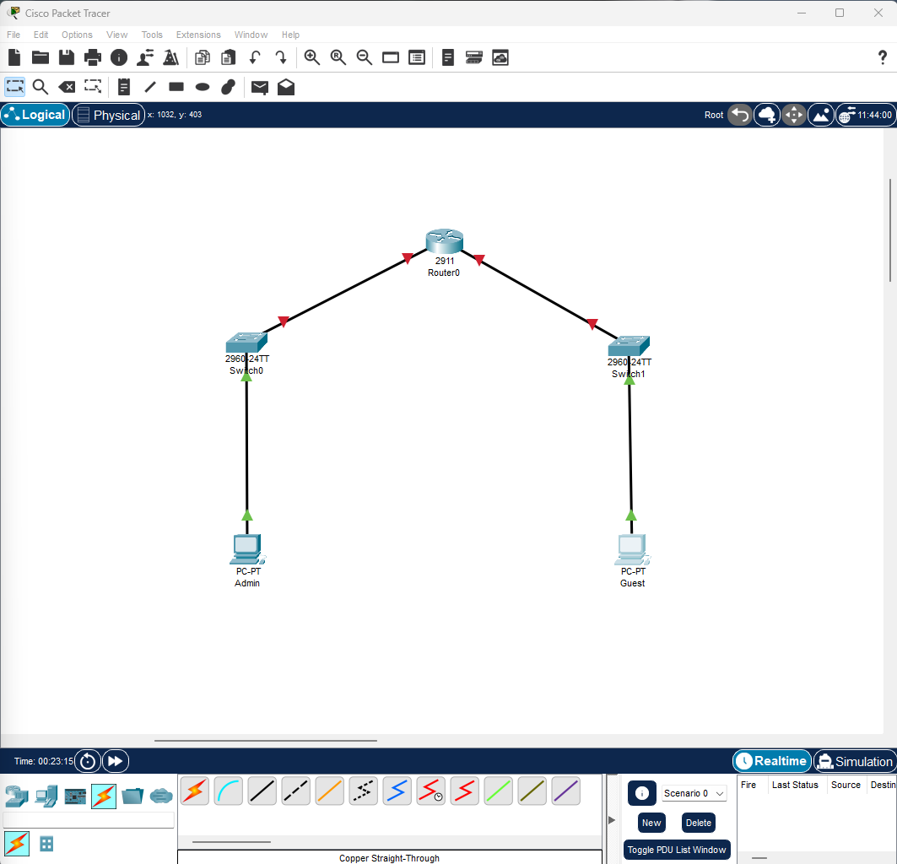
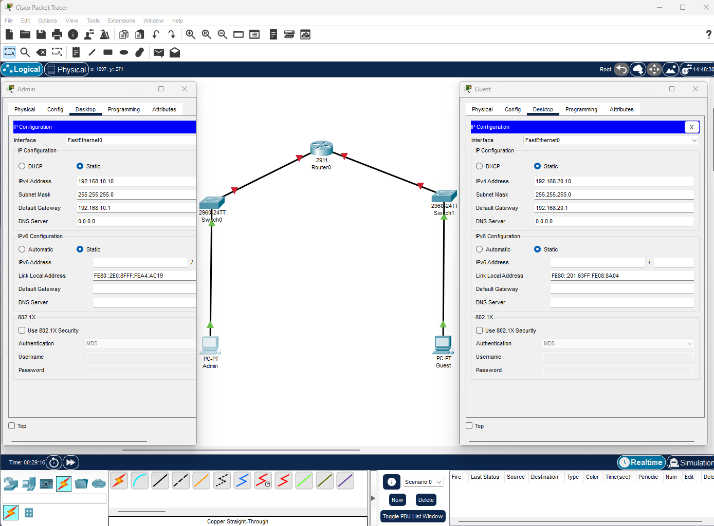
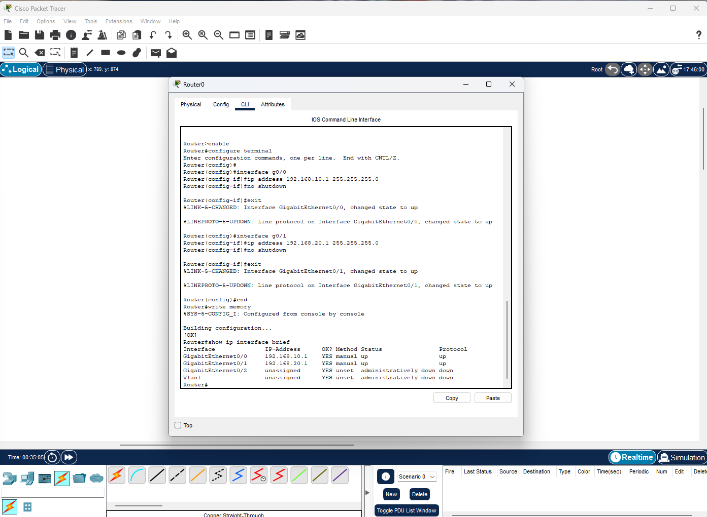
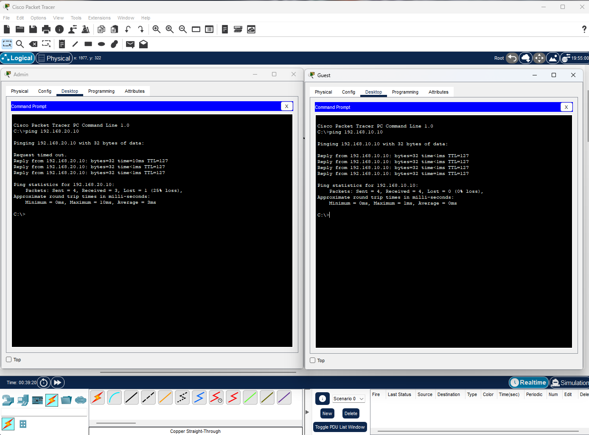
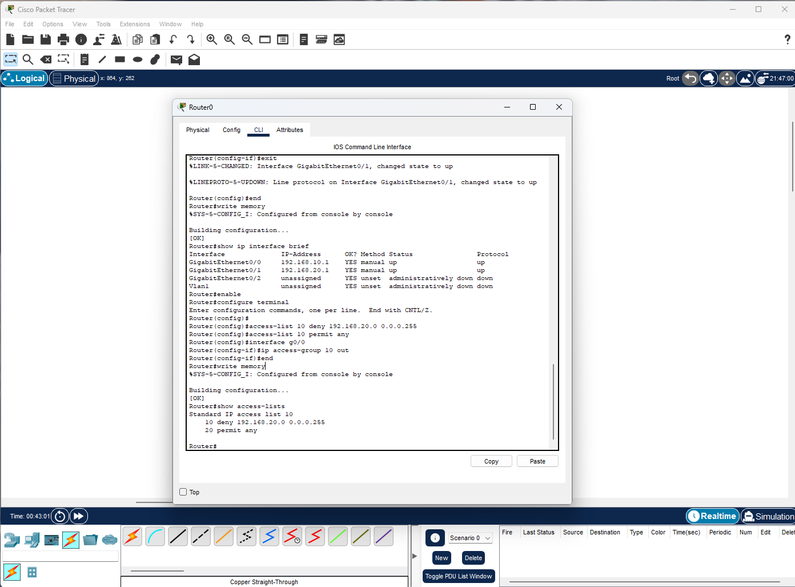
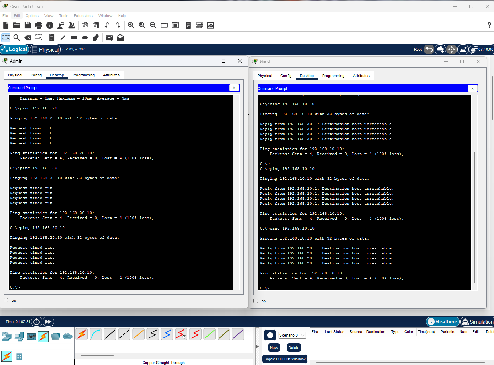

# LAB 004 - Standard ACLs

## Objective

Configure a Standard Access Control List (ACL) to control communication between two different networks and demonstrate the limitations of Standard ACLs in Cisco IOS.

---

## Topology

```text
Admin PC ---- Switch0 ---- Router 2911 ---- Switch1 ---- Guest PC
```

### Network Diagram



---

## IP Addressing

### Admin PC

| Parameter       | Value         |
| --------------- | ------------- |
| IP Address      | 192.168.10.10 |
| Subnet Mask     | 255.255.255.0 |
| Default Gateway | 192.168.10.1  |

### Guest PC

| Parameter       | Value         |
| --------------- | ------------- |
| IP Address      | 192.168.20.10 |
| Subnet Mask     | 255.255.255.0 |
| Default Gateway | 192.168.20.1  |

### Verification



---

## Router Configuration

Two interfaces were configured on the Cisco 2911 router:

| Interface          | IP Address   |
| ------------------ | ------------ |
| GigabitEthernet0/0 | 192.168.10.1 |
| GigabitEthernet0/1 | 192.168.20.1 |

### Verification



---

## Connectivity Test Before ACL

Connectivity was verified before applying the ACL.

### Verification



### Result

* Admin PC successfully reached Guest PC
* Guest PC successfully reached Admin PC
* Routing operated correctly

---

## Standard ACL Configuration

A Standard ACL was created to deny traffic originating from the Guest network.

```cisco
access-list 10 deny 192.168.20.0 0.0.0.255
access-list 10 permit any

interface GigabitEthernet0/0
 ip access-group 10 out
```

### Verification



---

## ACL Validation

Connectivity tests were repeated after applying the ACL.

### Verification



### Results

* Admin PC could no longer communicate with Guest PC
* Guest PC could no longer communicate with Admin PC
* ACL successfully filtered traffic
* Standard ACL limitations were observed

---

## Security Concepts

This laboratory demonstrates:

* Network traffic filtering
* Access Control Lists (ACLs)
* Source-based filtering
* Traffic control
* Cisco IOS security features
* Standard ACL behavior
* Access restriction techniques

---

## Skills Practiced

* Cisco IOS
* ACL Configuration
* Standard ACLs
* Router Configuration
* Layer 3 Routing
* Access Control
* Network Security
* Connectivity Testing
* Troubleshooting
* Cisco Packet Tracer

---

## Result

A Standard ACL was successfully implemented and validated. The laboratory demonstrated how Standard ACLs filter traffic based only on source addresses and highlighted their limitations when granular traffic control is required. These limitations justify the use of Extended ACLs in more advanced network security scenarios.
