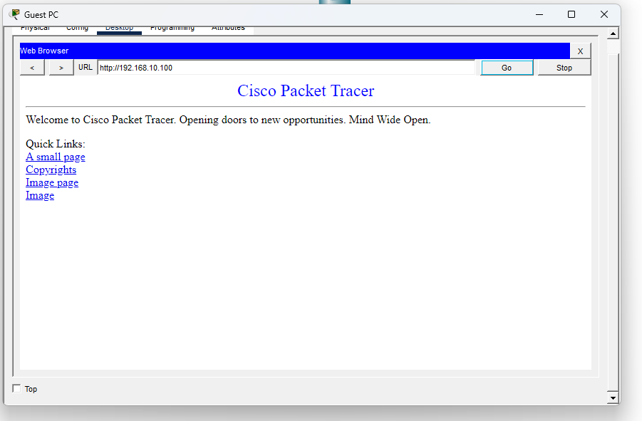

# LAB 005 - Extended ACLs

## Objective

Configure an Extended Access Control List (ACL) to block HTTP traffic from the Guest network to the Web Server while still allowing other network communications.

---

## Network Diagram


---

## IP Addressing

### Admin PC

| Parameter       | Value         |
| --------------- | ------------- |
| IP Address      | 192.168.10.10 |
| Subnet Mask     | 255.255.255.0 |
| Default Gateway | 192.168.10.1  |


### Web Server

| Parameter       | Value          |
| --------------- | -------------- |
| IP Address      | 192.168.10.100 |
| Subnet Mask     | 255.255.255.0  |
| Default Gateway | 192.168.10.1   |


### Guest PC

| Parameter       | Value         |
| --------------- | ------------- |
| IP Address      | 192.168.20.10 |
| Subnet Mask     | 255.255.255.0 |
| Default Gateway | 192.168.20.1  |


### Router Interfaces

| Interface          | IP Address   |
| ------------------ | ------------ |
| GigabitEthernet0/0 | 192.168.10.1 |
| GigabitEthernet0/1 | 192.168.20.1 |


---

## HTTP Service Configuration

The HTTP service was enabled on the Web Server before implementing the ACL policy.


---

## Verification Before ACL

Before applying the Extended ACL, connectivity between both networks was validated.

### ICMP Connectivity Test

The Guest PC successfully reached the Web Server through ICMP, confirming proper Layer 3 connectivity between the Guest and Admin networks.


### HTTP Access Test

The Guest PC was also able to access the Web Server through HTTP before the ACL was applied.



---

## Extended ACL Configuration

The following Extended ACL was configured to block HTTP traffic originating from the Guest network and destined for the Web Server.

```cisco
access-list 101 deny tcp 192.168.20.0 0.0.0.255 host 192.168.10.100 eq 80
access-list 101 permit ip any any

interface GigabitEthernet0/1
 ip access-group 101 in
```

The ACL was applied inbound on interface GigabitEthernet0/1.


---

## Verification After ACL

After the ACL was applied, HTTP traffic from the Guest network to the Web Server was successfully blocked.

### HTTP Blocked

When attempting to access the Web Server through a web browser, the Guest PC received a timeout response, confirming that HTTP traffic was being filtered by the ACL.


### ICMP Still Allowed

Ping traffic remained functional after the ACL implementation, proving that only HTTP traffic was restricted while other protocols continued to operate normally.


---

## Skills Demonstrated

* Extended ACL implementation
* Traffic filtering and access control
* HTTP service restriction
* Router security configuration
* Cisco IOS CLI administration
* Network troubleshooting
* Connectivity validation
* Security policy enforcement
* Layer 3 traffic analysis

---
## Learning Outcomes

After completing this lab, the following concepts were validated:

- Extended ACL creation and deployment
- Traffic filtering based on protocol and destination
- HTTP access control
- ACL placement best practices
- Network verification using ICMP and HTTP
- Cisco IOS CLI administration

---

## Conclusion

In this lab, an Extended ACL was implemented to control traffic between network segments. The configured policy successfully blocked HTTP access from the Guest network to the Web Server while maintaining normal network connectivity for other protocols such as ICMP.

Verification tests confirmed that:
- The Guest PC could successfully ping the Web Server.
- HTTP access from the Guest PC was denied.
- Network communication remained operational for authorized traffic.

This exercise reinforces important networking and cybersecurity concepts, including traffic filtering, access control, ACL placement, and network verification techniques. These skills are essential for network administrators, cybersecurity analysts, and Cisco certification candidates.

---

## Files

* LAB-005-Extended-ACLs.pkt
* README.md
* topology.png
* admin-pc-ip-configuration.png
* guest-pc-ip-configuration.png
* web-server-ip-configuration.png
* router-ip-addressing.png
* server-http-enabled.png
* http-connectivity-before-acl.png
* web-server-access-before-acl.png
* extended-acl-configuration.png
* http-blocked-after-acl.png
* ping-after-acl.png
