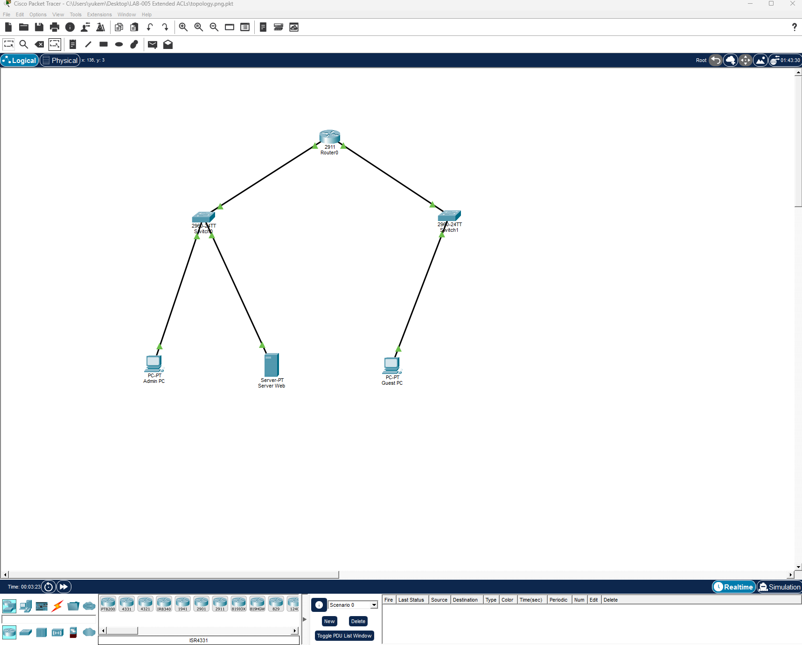
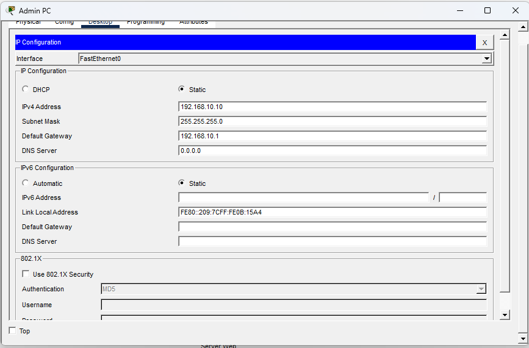
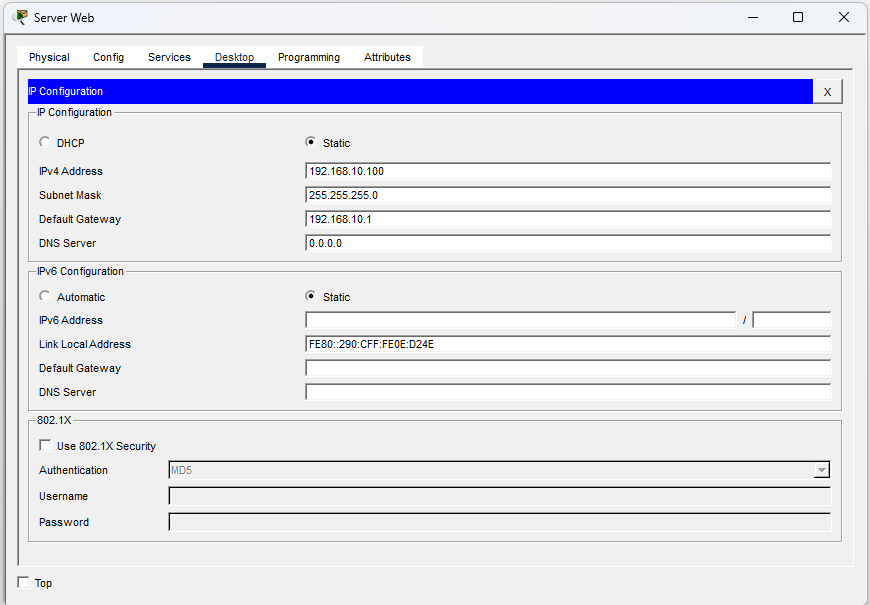
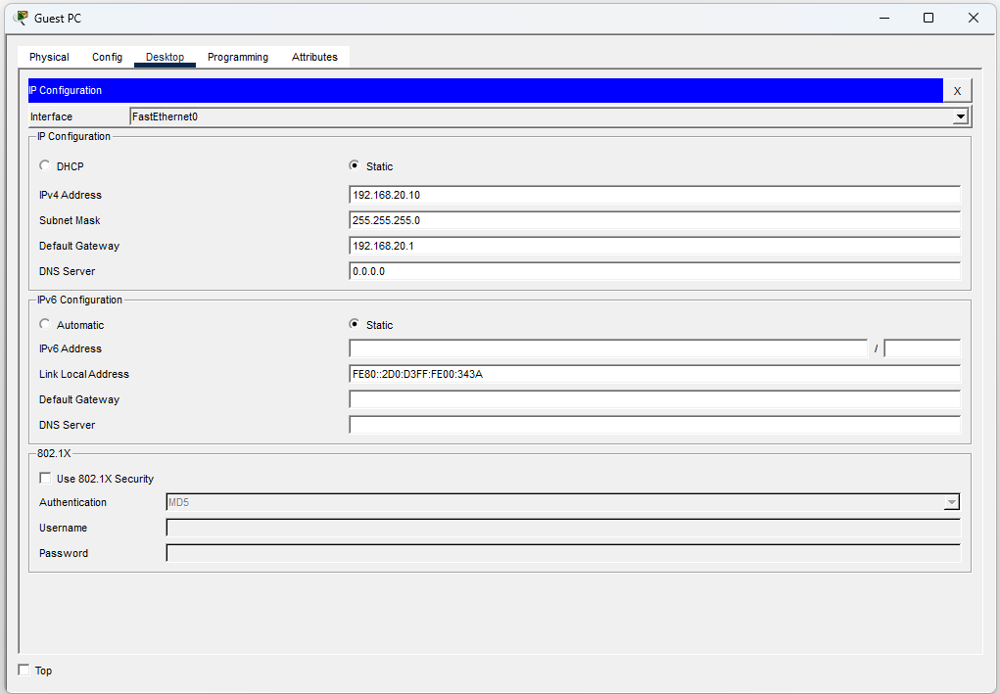
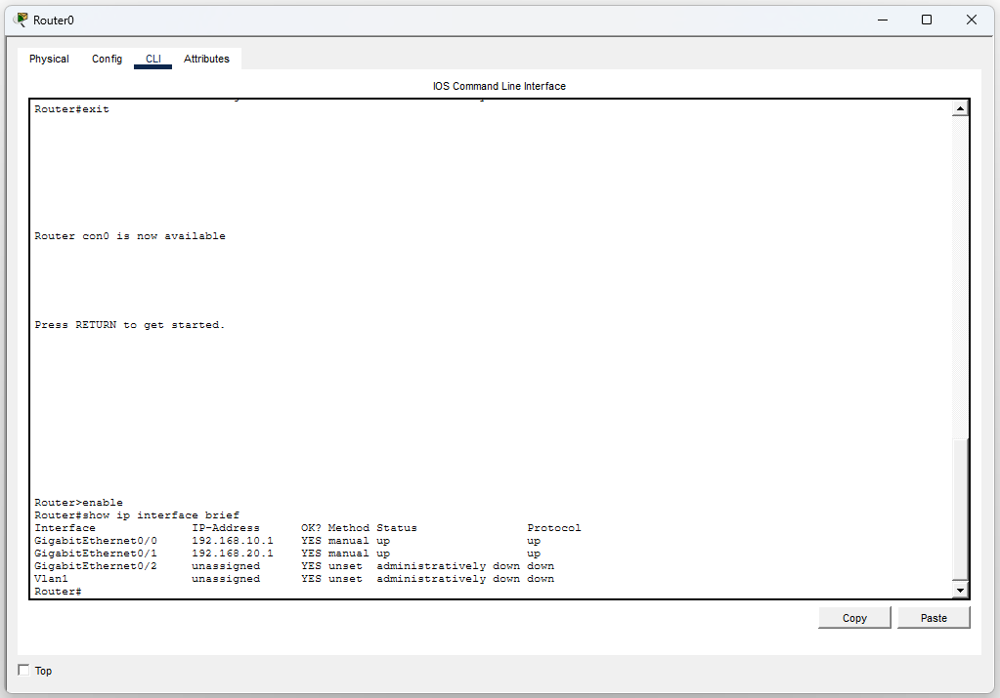
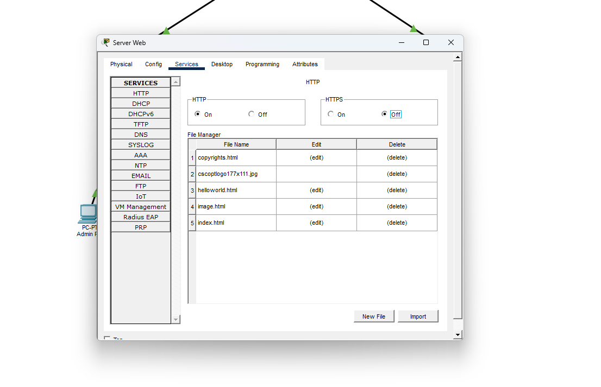
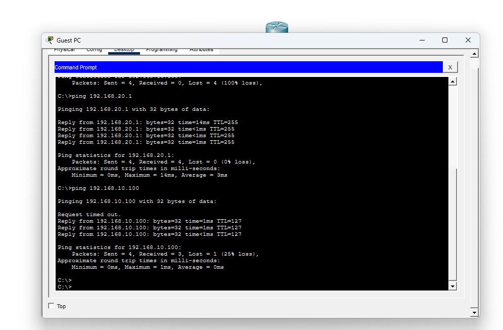
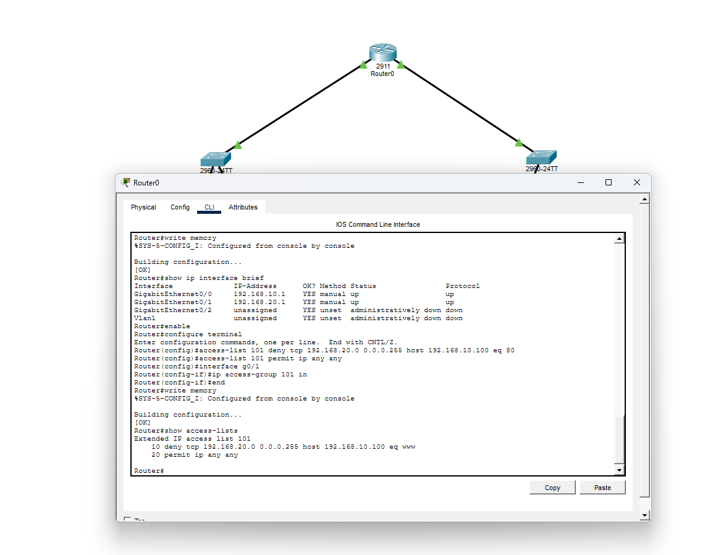
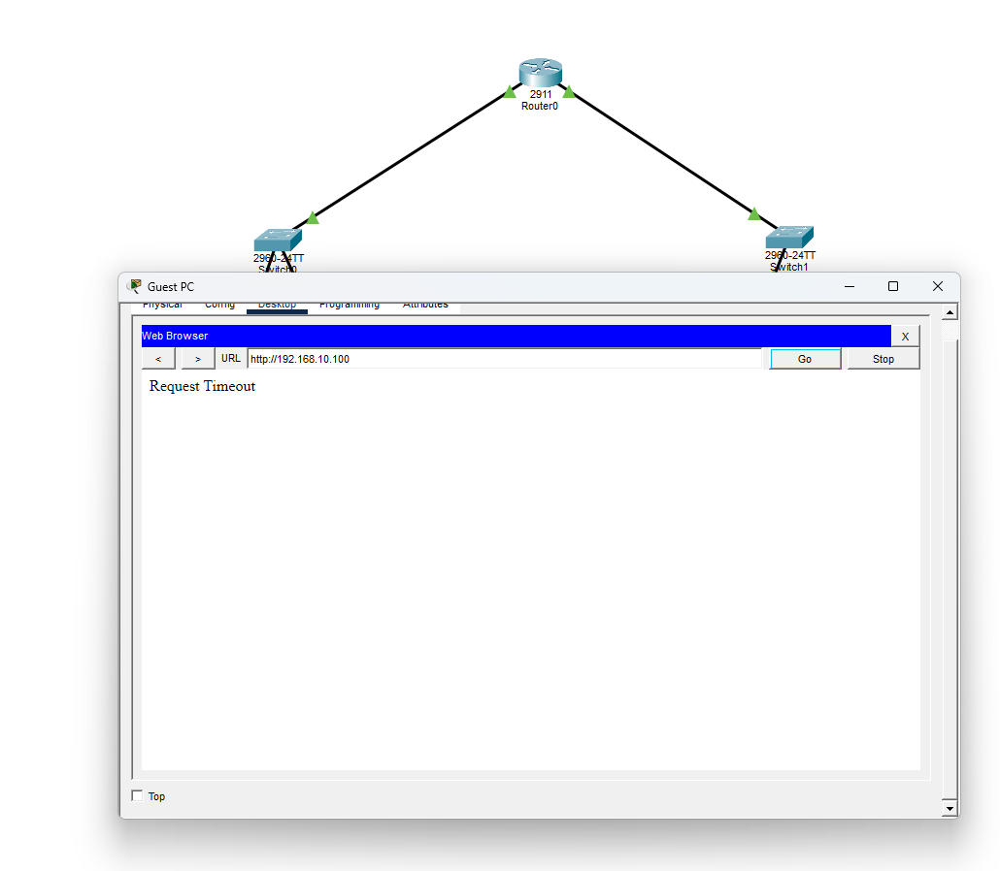
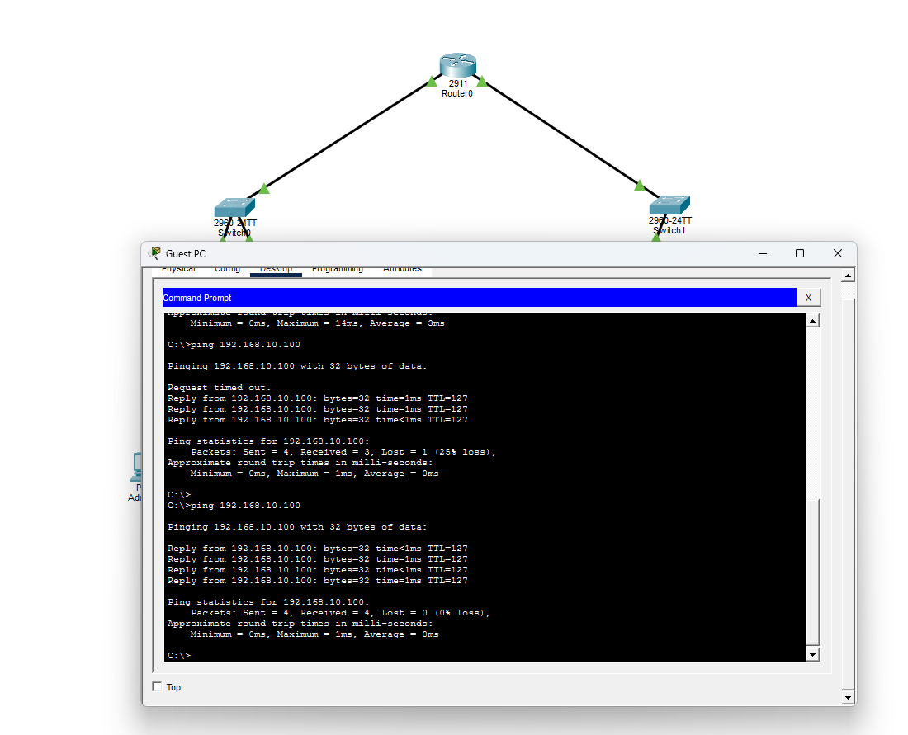

# LAB-005 - Extended ACLs

## Objective

Configure an Extended Access Control List (ACL) to block HTTP traffic from the Guest network to the Web Server while allowing all other network communications.

---

## Topology



---

## IP Addressing

### Admin PC

| Parameter       | Value         |
| --------------- | ------------- |
| IP Address      | 192.168.10.10 |
| Subnet Mask     | 255.255.255.0 |
| Default Gateway | 192.168.10.1  |



### Web Server

| Parameter       | Value          |
| --------------- | -------------- |
| IP Address      | 192.168.10.100 |
| Subnet Mask     | 255.255.255.0  |
| Default Gateway | 192.168.10.1   |



### Guest PC

| Parameter       | Value         |
| --------------- | ------------- |
| IP Address      | 192.168.20.10 |
| Subnet Mask     | 255.255.255.0 |
| Default Gateway | 192.168.20.1  |



### Router Interfaces

| Interface          | IP Address   |
| ------------------ | ------------ |
| GigabitEthernet0/0 | 192.168.10.1 |
| GigabitEthernet0/1 | 192.168.20.1 |



---

## Web Server Configuration

The HTTP service was enabled on the Web Server.



---

## Verification Before ACL

The Guest PC was able to access the Web Server through HTTP.



---

## ACL Configuration

The following Extended ACL was configured on the router:

```cisco
access-list 101 deny tcp 192.168.20.0 0.0.0.255 host 192.168.10.100 eq 80
access-list 101 permit ip any any

interface g0/1
ip access-group 101 in
```

ACL verification:

```cisco
show access-lists
```



---

## Verification After ACL

### HTTP Traffic Blocked

The Guest PC was no longer able to access the Web Server using HTTP.



### ICMP Traffic Allowed

Ping traffic remained functional, proving that only HTTP traffic was blocked.



---

## Security Concepts

This laboratory demonstrates:

* Extended Access Control Lists (ACLs)
* Protocol-based traffic filtering
* Port-based filtering
* HTTP traffic restriction
* Network segmentation
* Cisco IOS security features
* Access control implementation
* Traffic management

---

## Skills Practiced

* Cisco IOS
* Extended ACL Configuration
* Router Configuration
* Network Security
* Access Control
* Traffic Filtering
* Connectivity Testing
* Troubleshooting
* Cisco Packet Tracer

---

## Conclusion

This lab successfully demonstrated the implementation and validation of an Extended Access Control List (ACL) on a Cisco router.

A rule was configured to block HTTP traffic originating from the Guest network (192.168.20.0/24) to the Web Server (192.168.10.100) while allowing all other IP communications. Validation tests confirmed that web access was denied as expected, whereas ICMP connectivity remained functional.

This exercise highlights the flexibility of Extended ACLs, which can filter traffic based on source address, destination address, protocol, and port number. Such capabilities provide more granular traffic control than Standard ACLs and are widely used in enterprise network security environments.
