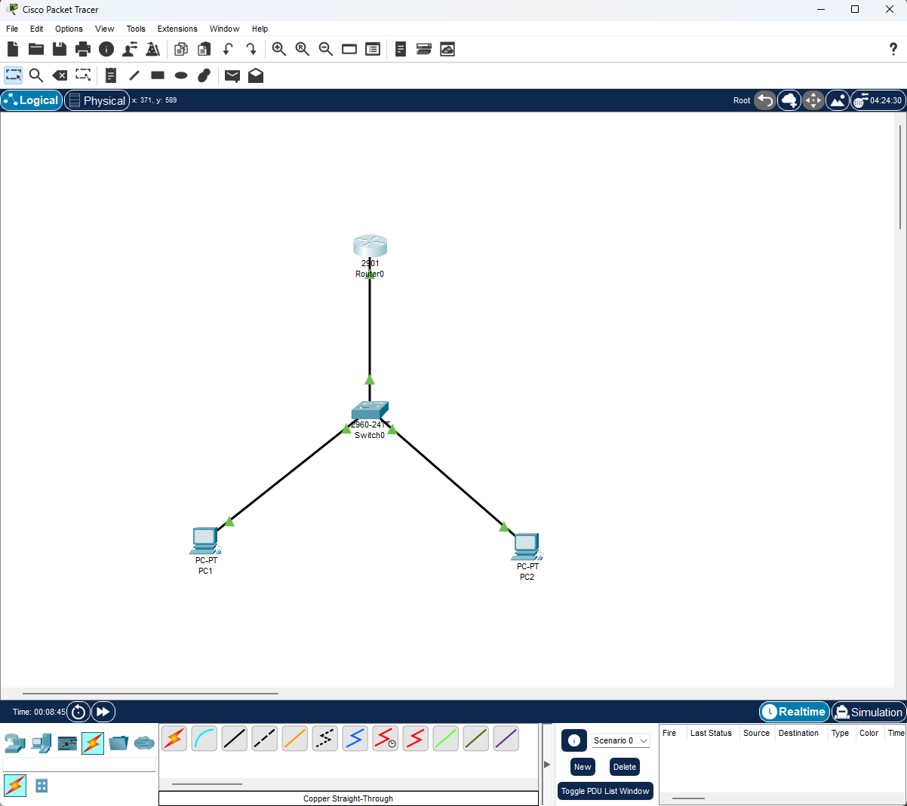
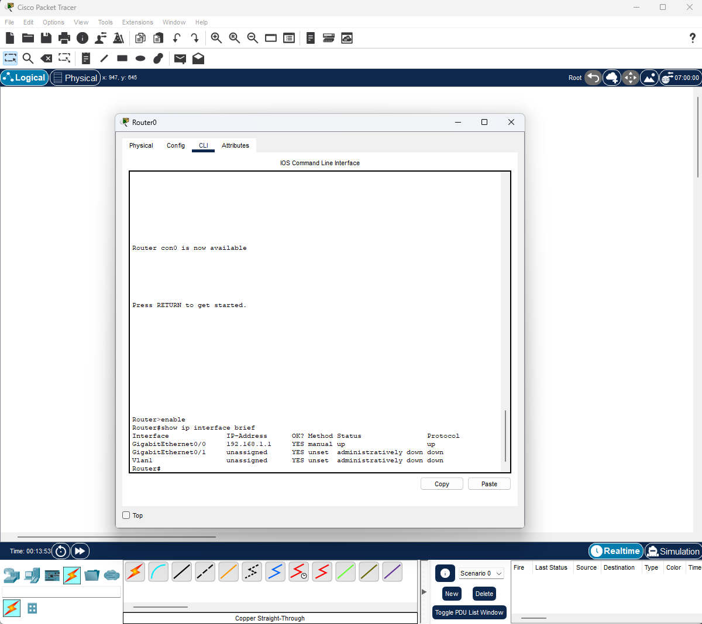
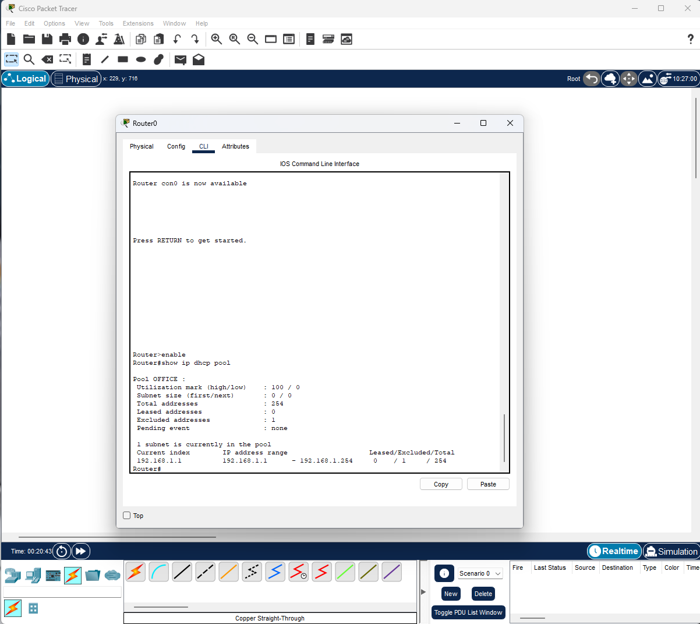
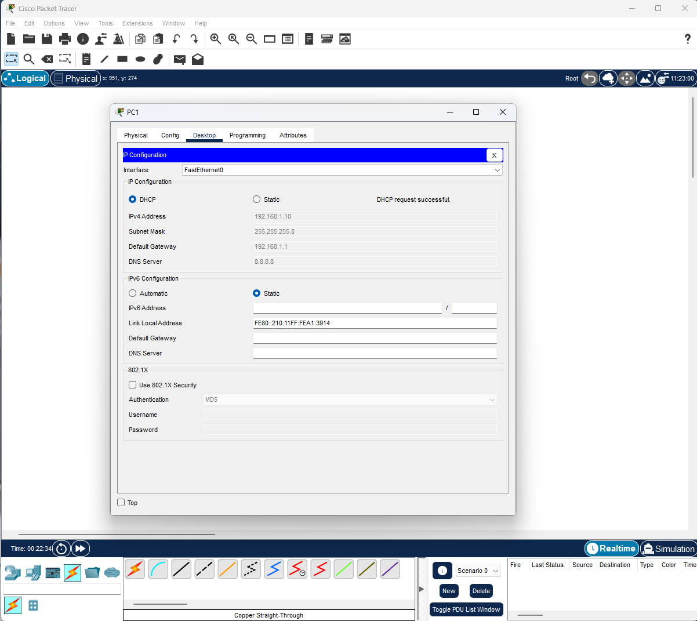
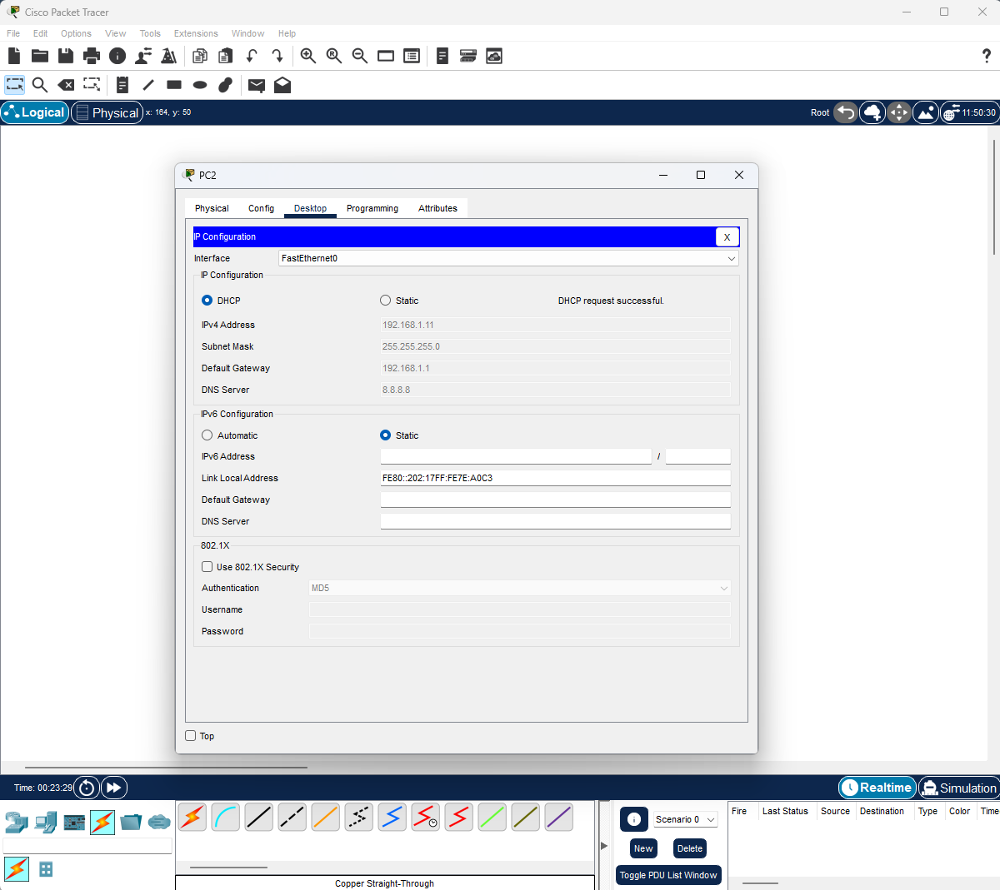
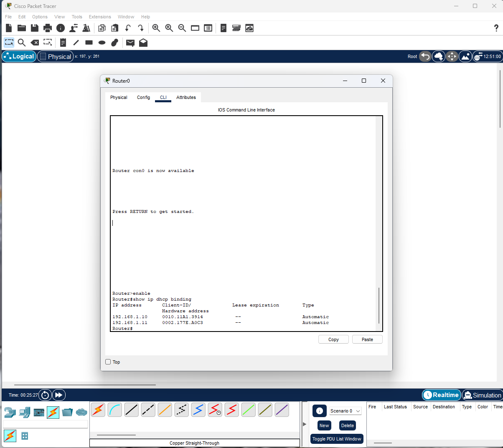
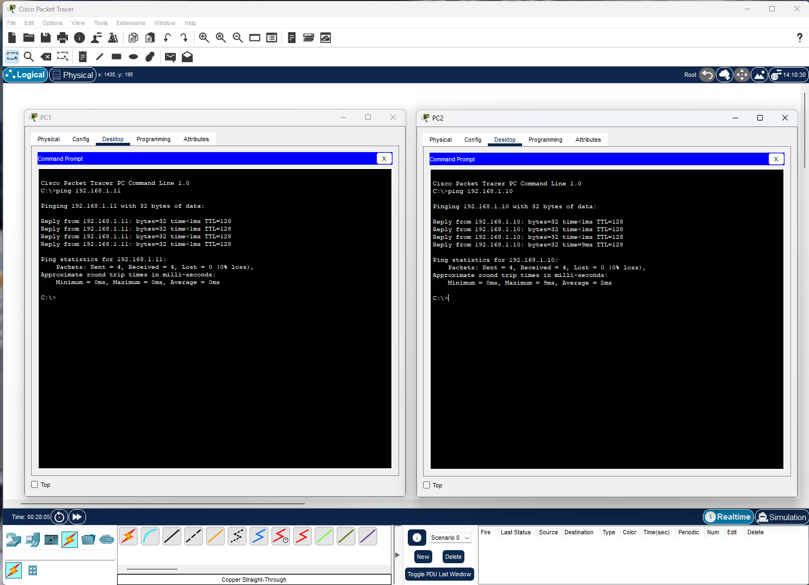

# LAB-006 - DHCP Configuration

## Objective

Configure a DHCP Server on a Cisco Router to automatically assign IP addresses to hosts connected to the network.

---

## Network Diagram



---

## IP Addressing

### Router

| Parameter   | Value              |
| ----------- | ------------------ |
| Interface   | GigabitEthernet0/0 |
| IP Address  | 192.168.1.1        |
| Subnet Mask | 255.255.255.0      |



### DHCP Scope

| Parameter        | Value         |
| ---------------- | ------------- |
| Network          | 192.168.1.0   |
| Subnet Mask      | 255.255.255.0 |
| Default Gateway  | 192.168.1.1   |
| DNS Server       | 8.8.8.8       |
| Excluded Address | 192.168.1.1   |

---

## DHCP Pool Configuration

A DHCP pool named **OFFICE** was created on the router to dynamically assign IP addresses to network clients.

```cisco
ip dhcp excluded-address 192.168.1.1

ip dhcp pool OFFICE
 network 192.168.1.0 255.255.255.0
 default-router 192.168.1.1
 dns-server 8.8.8.8
```

The DHCP pool was verified using the following command:

```cisco
show ip dhcp pool
```



---

## DHCP Client Configuration

Both PCs were configured to obtain IP addresses automatically using DHCP.

### PC1 DHCP Configuration

PC1 successfully received an IP address from the DHCP server.

| Parameter       | Value         |
| --------------- | ------------- |
| IP Address      | 192.168.1.10  |
| Subnet Mask     | 255.255.255.0 |
| Default Gateway | 192.168.1.1   |
| DNS Server      | 8.8.8.8       |



### PC2 DHCP Configuration

PC2 successfully received an IP address from the DHCP server.

| Parameter       | Value         |
| --------------- | ------------- |
| IP Address      | 192.168.1.11  |
| Subnet Mask     | 255.255.255.0 |
| Default Gateway | 192.168.1.1   |
| DNS Server      | 8.8.8.8       |



---

## DHCP Lease Verification

The DHCP bindings table confirms that both clients successfully obtained addresses from the DHCP server.

```cisco
show ip dhcp binding
```



---

## Connectivity Verification

After obtaining addresses from DHCP, connectivity between hosts was validated.

### PC1 → PC2

PC1 successfully reached PC2 through ICMP.

### PC2 → PC1

PC2 successfully reached PC1 through ICMP.

The successful ping responses confirm:

* Correct DHCP operation
* Proper default gateway assignment
* Valid Layer 3 connectivity
* Successful host communication



---

## Skills Demonstrated

* DHCP Server configuration on Cisco IOS
* DHCP Pool creation and management
* IP address exclusion configuration
* Dynamic IP address assignment
* DHCP lease verification
* Cisco IOS CLI administration
* Network troubleshooting
* Connectivity validation
* Dynamic host configuration management
* Layer 3 network verification

---

## Conclusion

In this lab, a Cisco Router was successfully configured as a DHCP Server to automatically distribute IP addresses to network hosts.

Both clients received valid IP configurations including IP address, subnet mask, default gateway, and DNS server information directly from the DHCP service. Verification of the DHCP pool and binding table confirmed that address allocation was functioning correctly.

Connectivity tests between the hosts demonstrated that the dynamically assigned configurations were fully operational, validating the successful implementation of DHCP services in a small enterprise network environment.

This exercise reinforces fundamental networking concepts related to IP address management, automated host configuration, DHCP troubleshooting, and Cisco IOS administration skills commonly required in networking and cybersecurity roles.

---

## Files

* LAB-006-DHCP.pkt
* README.md
* topology.png
* router-ip-addressing.png
* dhcp-pool-configuration.png
* pc1-dhcp-address.png
* pc2-dhcp-address.png
* dhcp-bindings.png
* dhcp-connectivity-test.png
