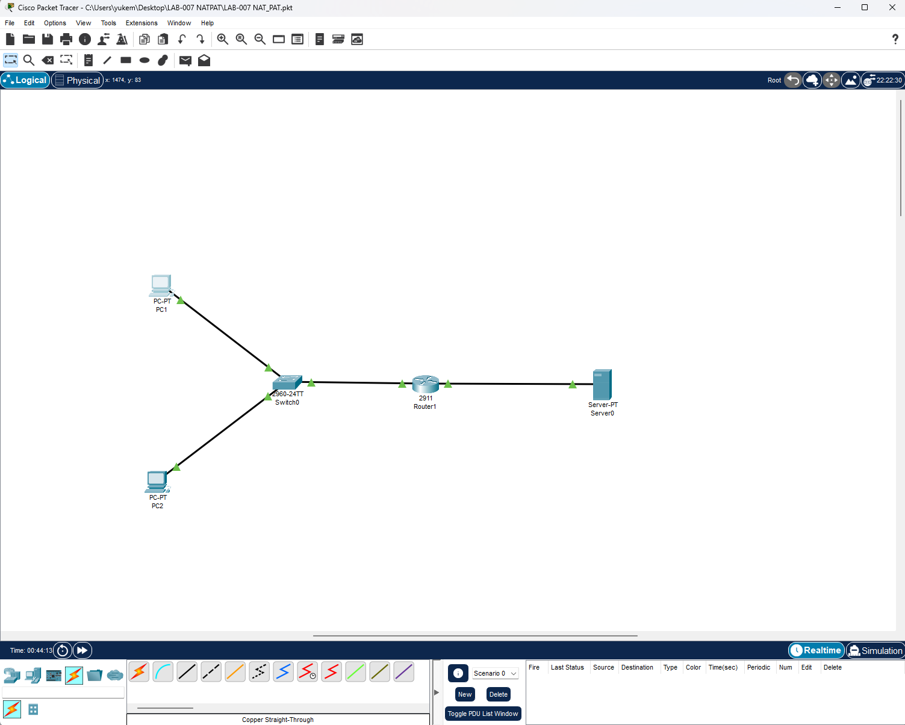
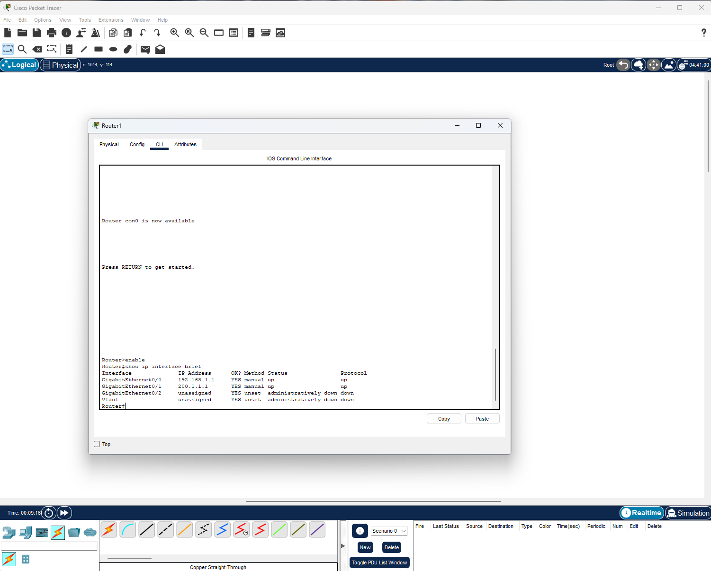
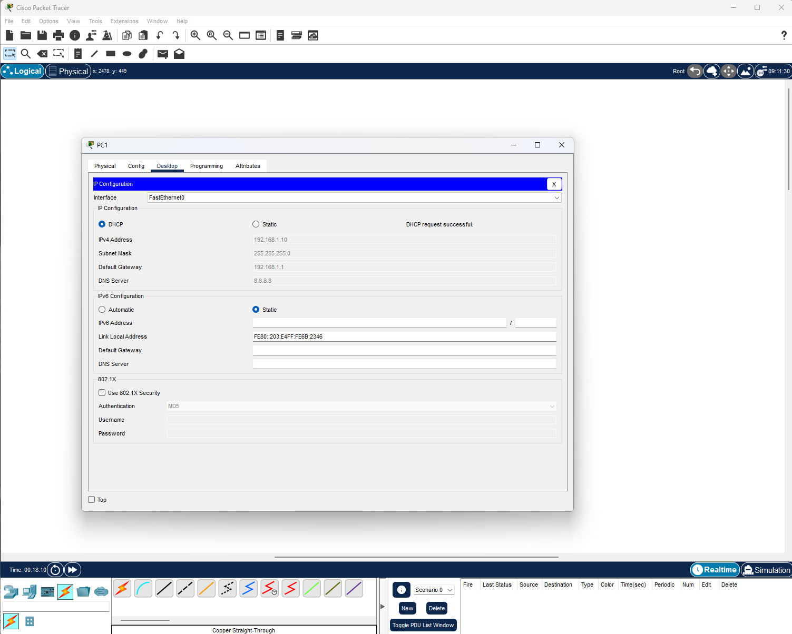
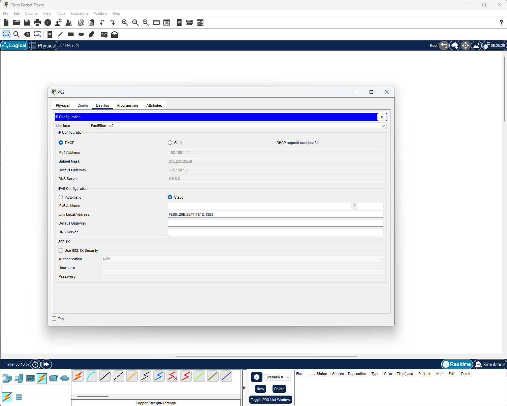
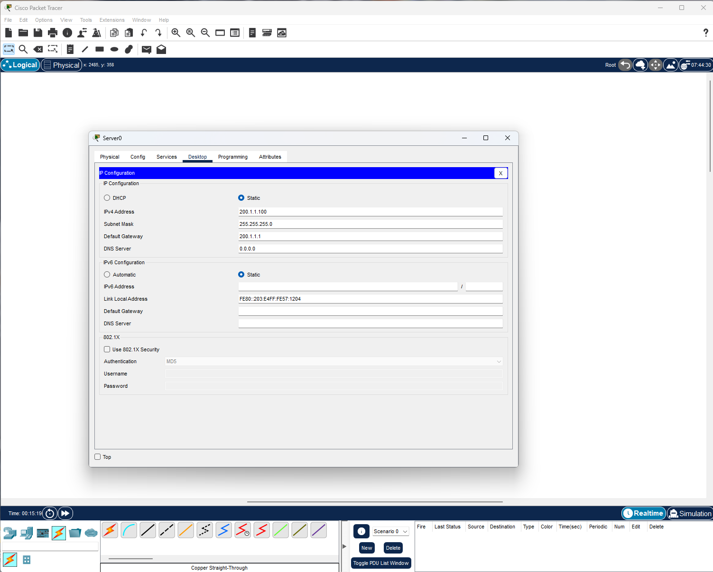
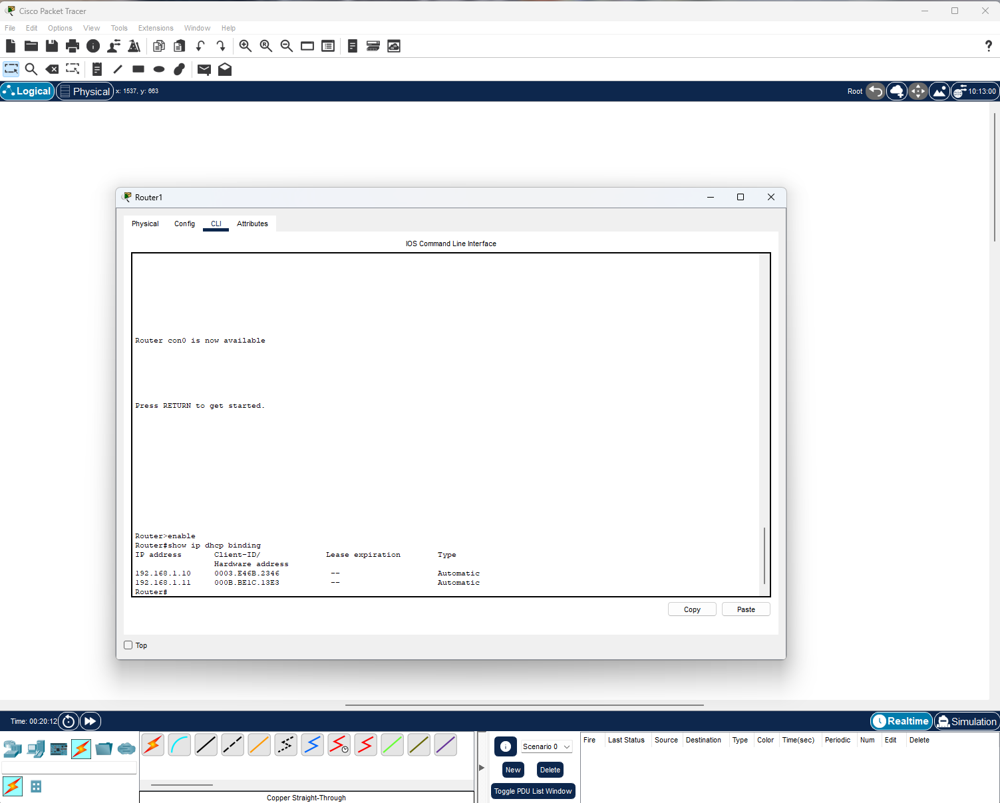
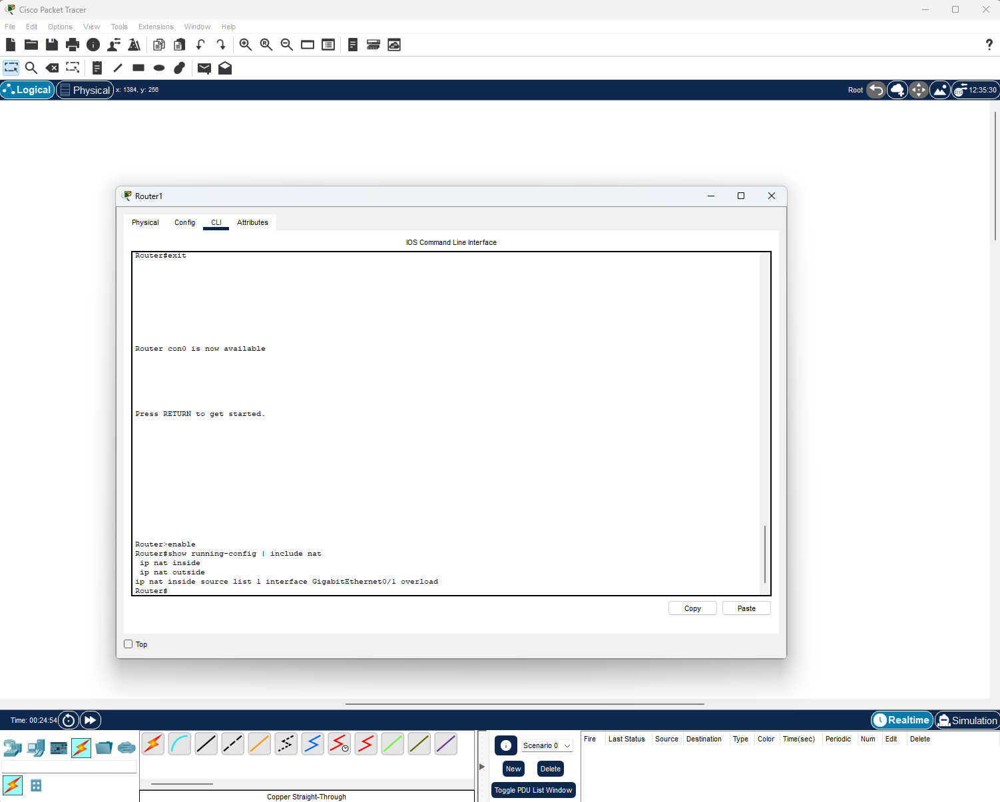
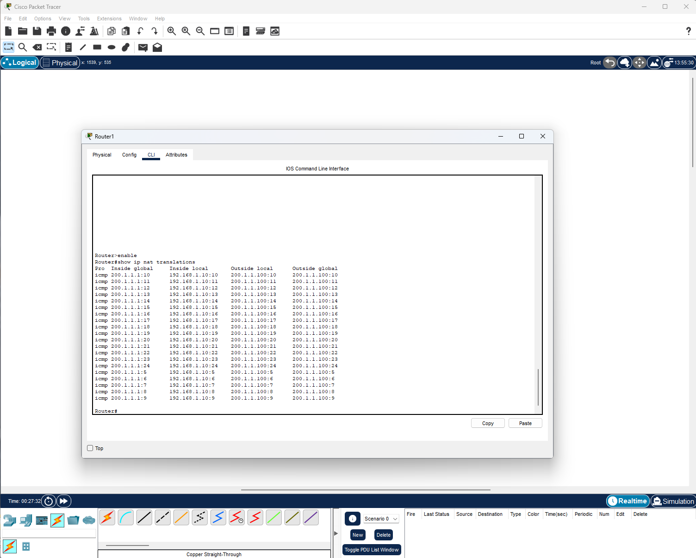
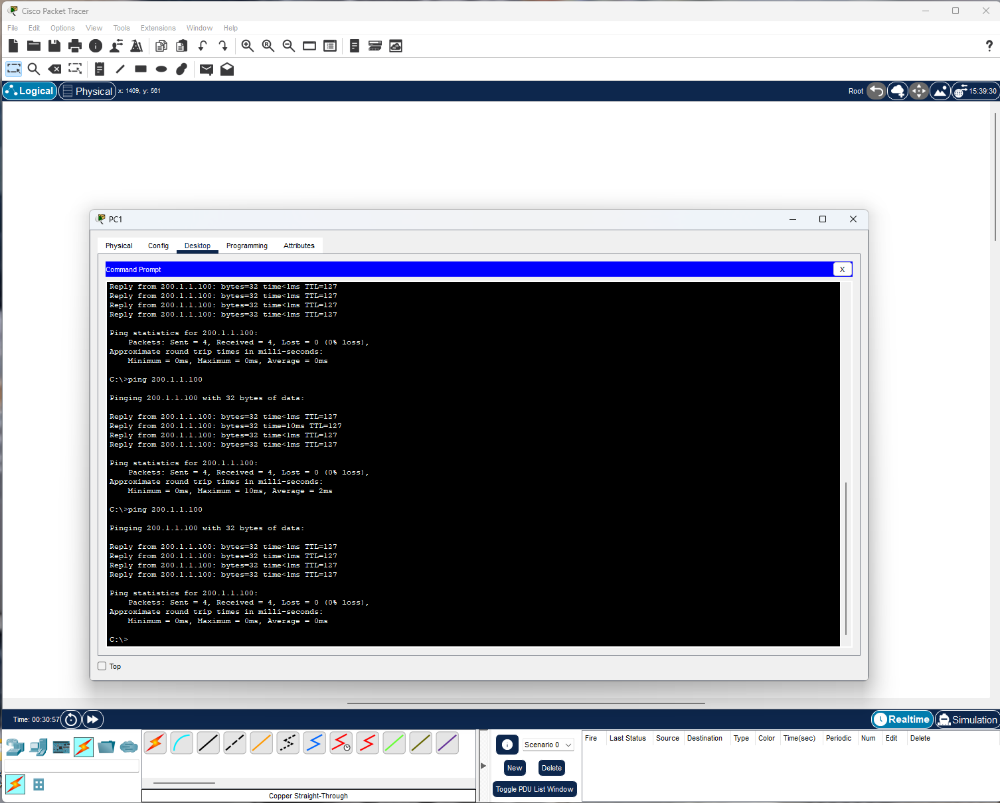

# LAB-007 - NAT/PAT Configuration

## Objective

Configure Network Address Translation (NAT) with Port Address Translation (PAT) on a Cisco Router to allow multiple internal hosts to access external network resources using a single public IP address.

---

## Network Diagram



---

## IP Addressing

### Router Interfaces

| Interface          | IP Address  | Role        |
| ------------------ | ----------- | ----------- |
| GigabitEthernet0/0 | 192.168.1.1 | NAT Inside  |
| GigabitEthernet0/1 | 200.1.1.1   | NAT Outside |



### Internal Hosts

#### PC1

| Parameter       | Value         |
| --------------- | ------------- |
| IP Address      | 192.168.1.10  |
| Subnet Mask     | 255.255.255.0 |
| Default Gateway | 192.168.1.1   |
| DNS Server      | 8.8.8.8       |



#### PC2

| Parameter       | Value         |
| --------------- | ------------- |
| IP Address      | 192.168.1.11  |
| Subnet Mask     | 255.255.255.0 |
| Default Gateway | 192.168.1.1   |
| DNS Server      | 8.8.8.8       |



### External Server

| Parameter       | Value         |
| --------------- | ------------- |
| IP Address      | 200.1.1.100   |
| Subnet Mask     | 255.255.255.0 |
| Default Gateway | 200.1.1.1     |



---

## DHCP Verification

The internal hosts received their IP addresses dynamically from the DHCP service previously configured on the router.

The DHCP binding table confirms successful address assignment.

```cisco
show ip dhcp binding
```



---

## NAT/PAT Configuration

PAT (Port Address Translation) was configured using the router's public interface address.

```cisco
access-list 1 permit 192.168.1.0 0.0.0.255

interface GigabitEthernet0/0
 ip nat inside

interface GigabitEthernet0/1
 ip nat outside

ip nat inside source list 1 interface GigabitEthernet0/1 overload
```

The NAT configuration was verified using:

```cisco
show running-config | include nat
```



---

## NAT Translation Verification

After traffic was generated from the internal network, NAT translations were successfully created.

The following command was used to verify active translations:

```cisco
show ip nat translations
```

The translation table demonstrates that the private address 192.168.1.10 was translated to the public address 200.1.1.1 using different port identifiers, validating PAT functionality.



---

## Connectivity Verification

After NAT/PAT implementation, connectivity between the internal network and the external server was validated.

### PC1 → External Server

PC1 successfully reached the external server using ICMP.

### NAT Operation Validation

The successful communication confirms:

* Correct NAT Inside and Outside configuration
* Proper PAT operation using overload
* Successful address translation
* Layer 3 connectivity between private and external networks



---

## Skills Demonstrated

* NAT configuration on Cisco IOS
* PAT (NAT Overload) implementation
* Public and private IP address translation
* Access Control List integration with NAT
* DHCP and NAT interoperability
* Cisco IOS CLI administration
* Network troubleshooting
* Connectivity validation
* Translation table analysis
* Enterprise edge-router configuration

---

## Conclusion

In this lab, Network Address Translation with Port Address Translation (PAT) was successfully implemented on a Cisco Router.

The solution allowed multiple internal hosts using private IP addresses to communicate with external network resources through a single public IP address. Verification of the NAT configuration and translation table confirmed that address translation was functioning correctly.

Connectivity tests demonstrated successful communication between the internal network and the external server while maintaining proper address translation through PAT overload.

This exercise reinforces essential networking concepts related to NAT, PAT, private-to-public address translation, edge-network design, and Cisco IOS administration. These skills are widely used in enterprise networks and are fundamental for networking and cybersecurity professionals.

---

## Files

* LAB-007-NAT-PAT.pkt
* README.md
* topology.png
* router-ip-addressing.png
* server-ip-configuration.png
* pc1-dhcp-address.png
* pc2-dhcp-address.png
* dhcp-bindings.png
* nat-configuration.png
* nat-translations.png
* nat-connectivity-test.png
