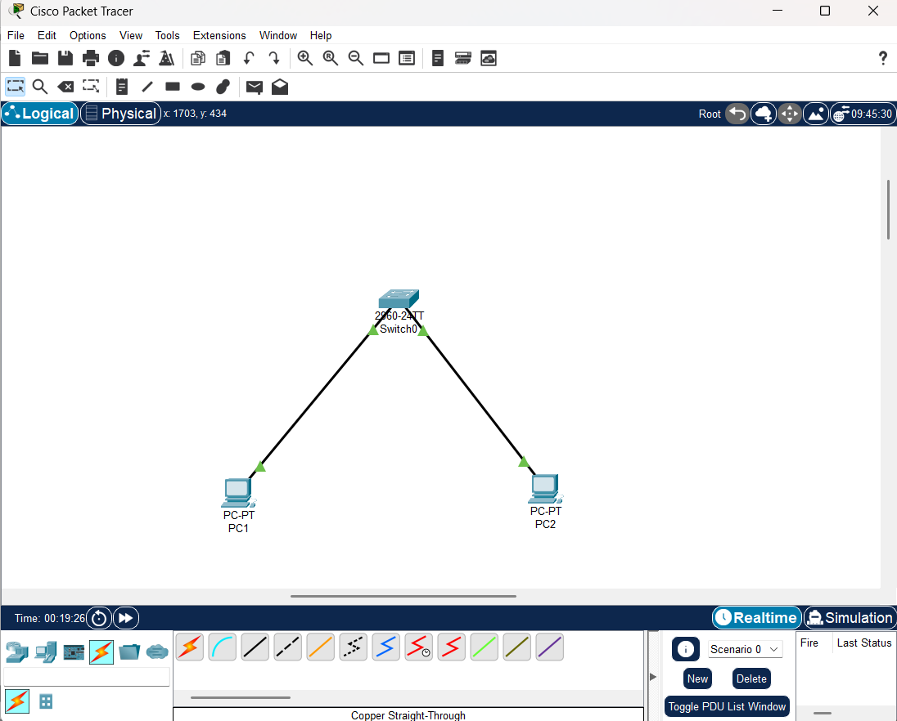
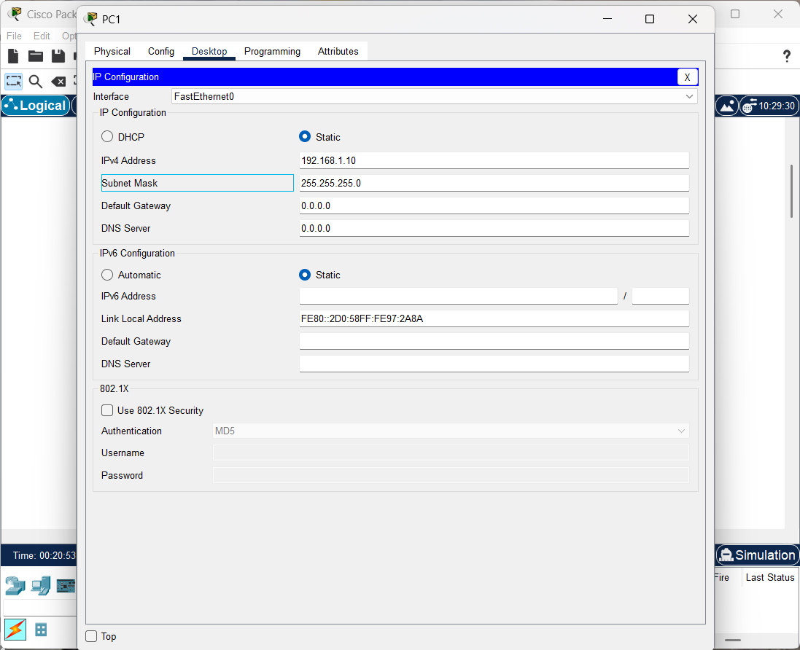
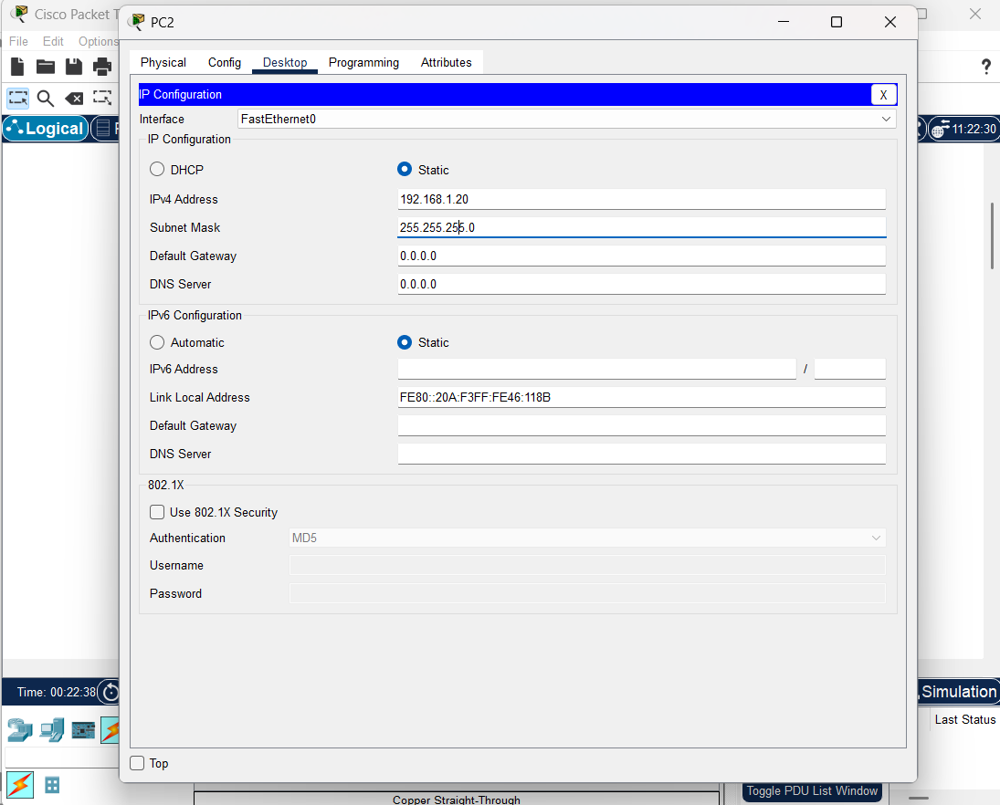
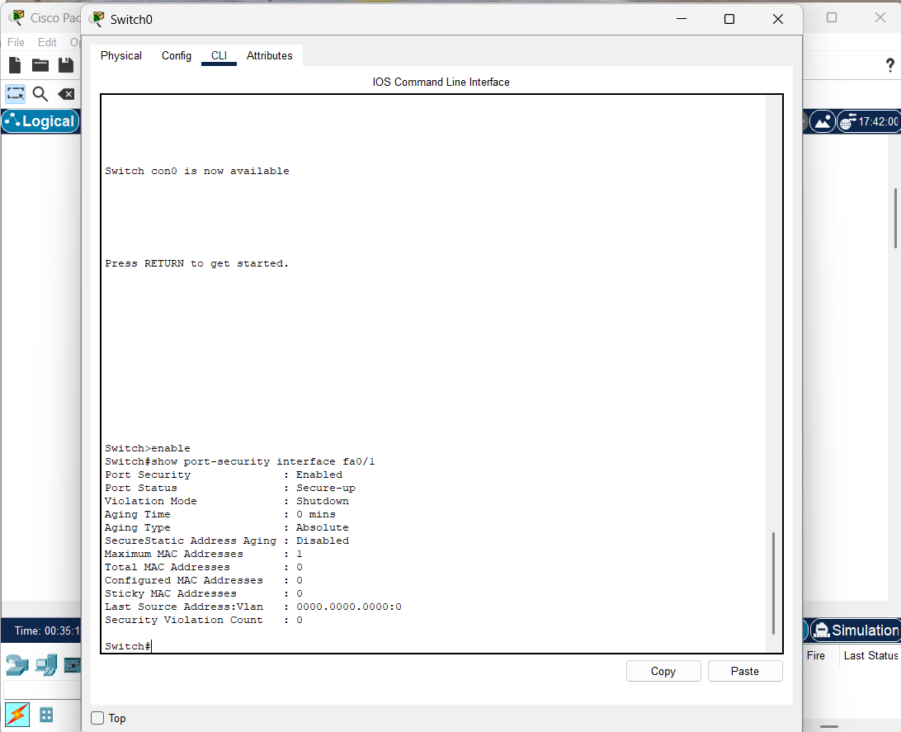
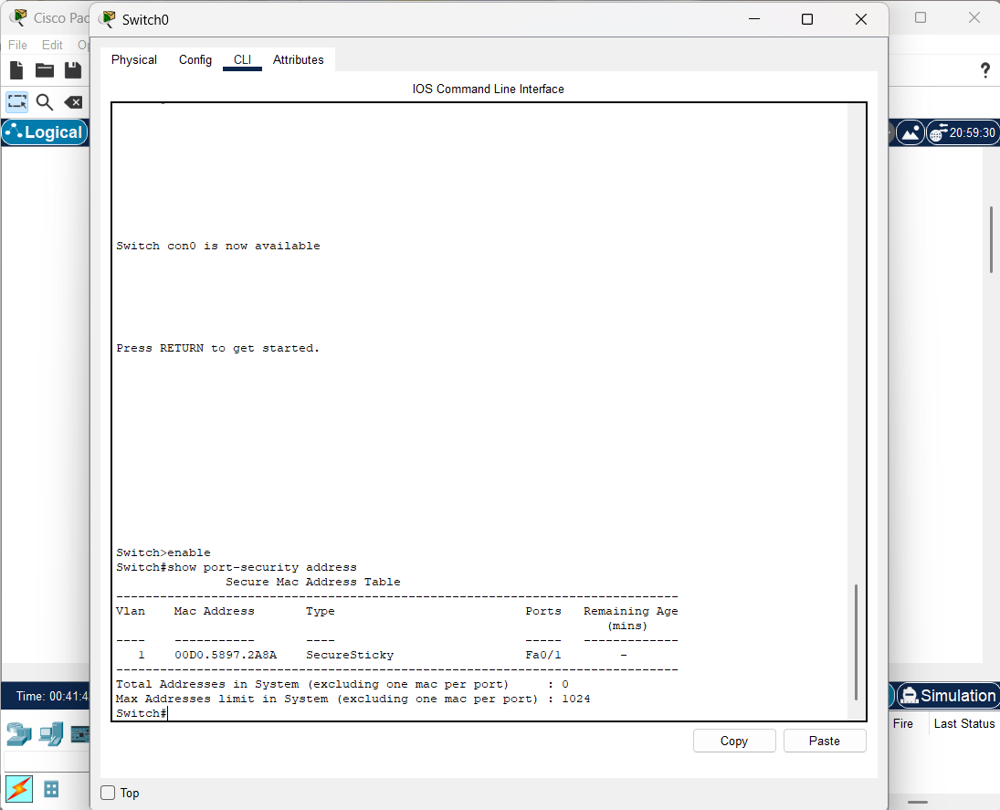
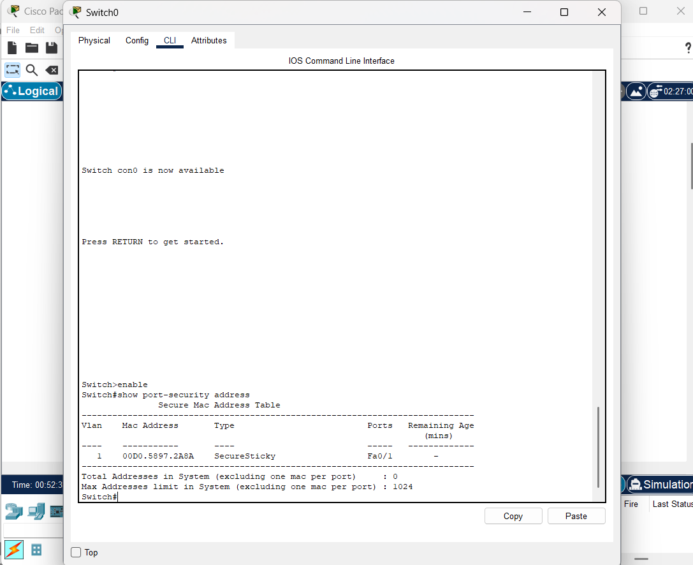
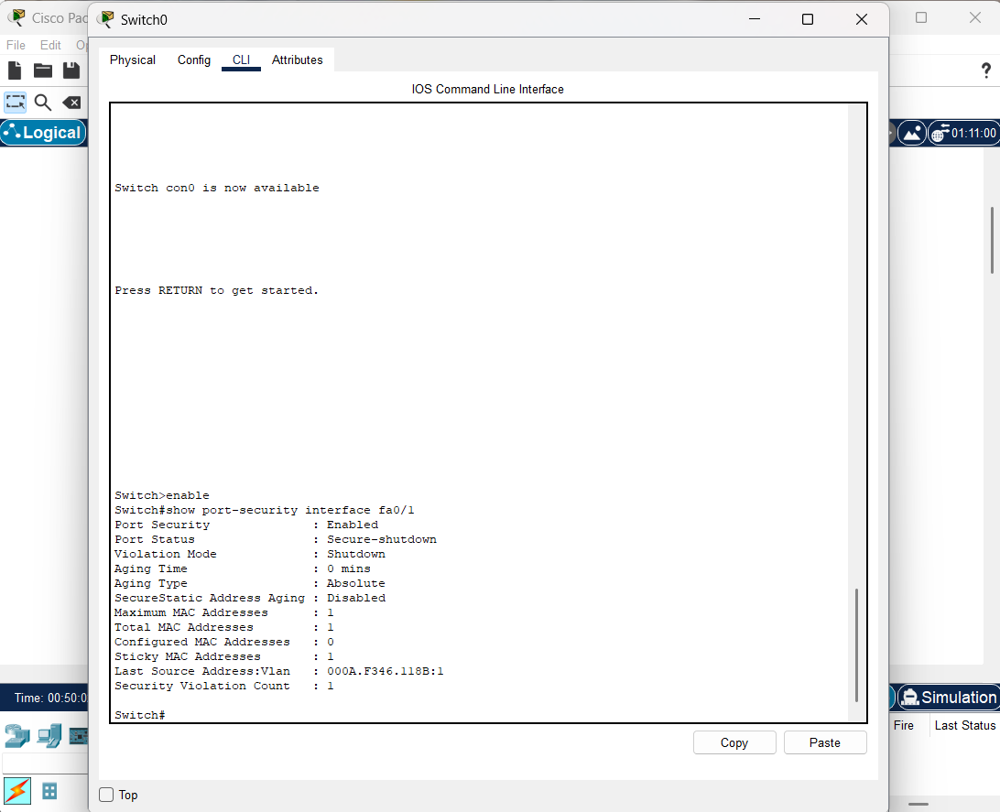
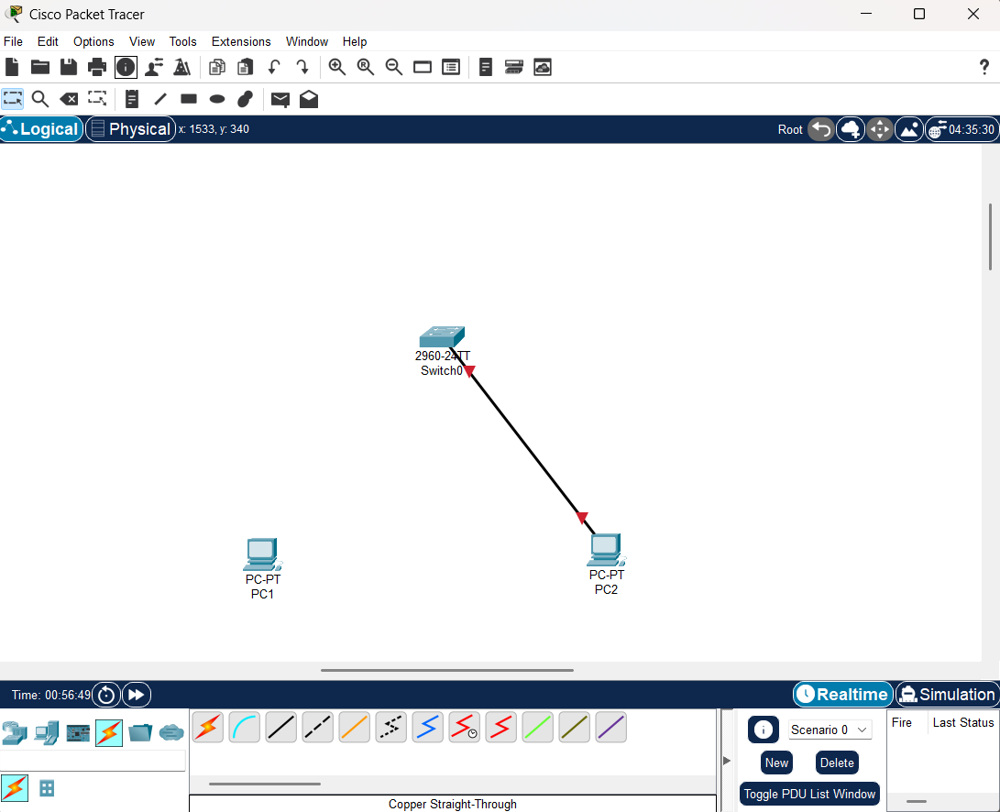

# LAB-008 - Switch Port Security

## Objective

Configure and validate Port Security on a Cisco Switch to restrict network access based on MAC addresses and automatically protect the network against unauthorized devices.

---

## Network Diagram



---

## IP Addressing

### PC1

| Parameter   | Value         |
| ----------- | ------------- |
| IP Address  | 192.168.1.10  |
| Subnet Mask | 255.255.255.0 |



### PC2

| Parameter   | Value         |
| ----------- | ------------- |
| IP Address  | 192.168.1.20  |
| Subnet Mask | 255.255.255.0 |



---

## Port Security Configuration

Port Security was configured on interface **FastEthernet0/1** to allow only one MAC address and automatically learn the connected device using Sticky MAC Address functionality.

### Configuration Applied

```cisco
interface FastEthernet0/1
 switchport mode access
 switchport port-security
 switchport port-security maximum 1
 switchport port-security mac-address sticky
 switchport port-security violation shutdown
```

The configuration was verified using the following command:

```cisco
show port-security interface fa0/1
```

The output confirms that Port Security is enabled and configured to shut down the interface if an unauthorized device is detected.



---

## Sticky MAC Address Learning

After the authorized device was connected to the protected port, the switch dynamically learned its MAC address and stored it as a Secure Sticky entry.

Verification command:

```cisco
show port-security address
```

The Secure MAC Address Table confirms that the authorized device MAC address was successfully learned and associated with interface FastEthernet0/1.



---

## Port Security Status Verification

After learning the authorized MAC address, the operational status of the secured interface was validated.

Verification command:

```cisco
show port-security interface fa0/1
```

The output confirms:

* Port Security Enabled
* Port Status: Secure-up
* Sticky MAC Addresses: 1
* Security Violation Count: 0

This indicates normal operation of the protected interface.



---

## Security Violation Test

To validate the security mechanism, the authorized device was disconnected and another device was connected to the protected interface.

Since the new device presented a different MAC address than the one previously learned by the switch, a security violation occurred.

Verification command:

```cisco
show port-security interface fa0/1
```

The output confirms:

* Port Status: Secure-shutdown
* Violation Mode: Shutdown
* Sticky MAC Addresses: 1
* Security Violation Count: 1

The switch automatically disabled the interface to prevent unauthorized access.



---

## Topology After Security Violation

The following topology illustrates the final network state after the unauthorized device triggered the Port Security policy.

The protected interface was automatically placed into a Secure-Shutdown state, preventing network communication through the port.



---

## Port Security Operation Summary

### Authorized Device

| Feature               | Status    |
| --------------------- | --------- |
| Port Security Enabled | Yes       |
| Sticky MAC Learned    | Yes       |
| Maximum MAC Addresses | 1         |
| Port Status           | Secure-up |
| Security Violations   | 0         |

### Unauthorized Device

| Feature                        | Status          |
| ------------------------------ | --------------- |
| Different MAC Address Detected | Yes             |
| Security Violation Triggered   | Yes             |
| Port Shutdown Executed         | Yes             |
| Port Status                    | Secure-shutdown |

---

## Skills Demonstrated

* Cisco Switch Security Configuration
* Port Security Implementation
* Sticky MAC Address Learning
* Secure MAC Address Verification
* Unauthorized Device Detection
* Layer 2 Security Controls
* Cisco IOS CLI Administration
* Access Layer Protection
* Security Policy Enforcement
* Network Troubleshooting
* Basic Enterprise Network Security

---

## Conclusion

In this lab, Port Security was successfully implemented on a Cisco Switch to protect a network access port using MAC address-based access control.

The switch dynamically learned the MAC address of the authorized device through Sticky MAC functionality and enforced a limit of one MAC address on the protected interface.

When a different device attempted to connect to the same port, the switch correctly detected the unauthorized MAC address and automatically placed the interface into a Secure-Shutdown state according to the configured security policy.

This exercise demonstrates a fundamental Layer 2 security feature widely used in enterprise environments to prevent unauthorized access, rogue devices, and basic access-layer attacks while reinforcing practical Cisco IOS administration and network security skills.

---

## Files

* topology(3).pkt
* README.md
* Topology(8).png
* pc1-ip-configuration(3).png
* pc2-ip-configuration(3).png
* port-security-configuration(3).png
* port-security-status(4).png
* secure-mac-address(3).png
* security-violation(3).png
* topology_security-violation(4).png
